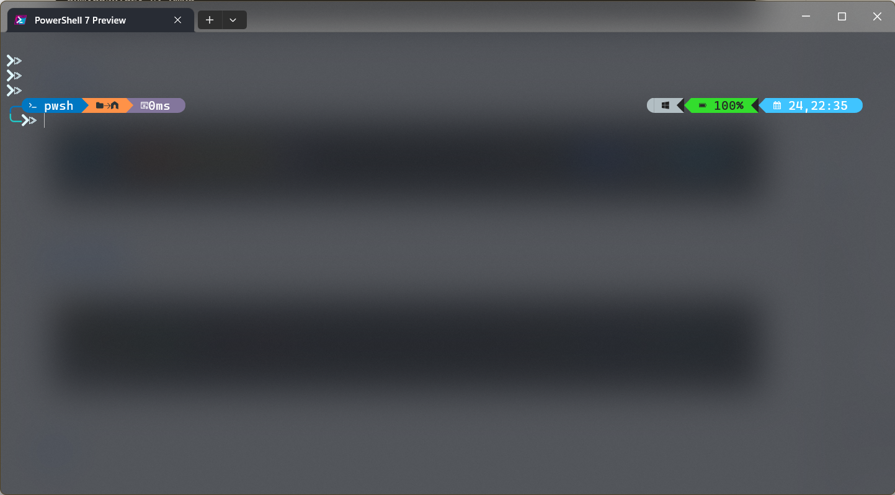

# Posh-Transient

A simple command-line tool that automatically adds [transient-prompt](https://ohmyposh.dev/docs/configuration/transient) to your [oh-my-posh](https://ohmyposh.dev/) configuration, based on the rightest left segment of your input line.

## Install

```shell
cargo install posh-transient
```

## Usage

### One-time generate

```shell
# prints path to the generated file
posh-transient <input theme json> <output folder or file>
```

If an output folder (instead of a preexisted file) is specified, assume your input is `theme.json`, the output filename would be `theme.transient.json`.

### Put it inside `oh-my-posh init`

Replace your configuration path to an invocation of this program.

Take pwsh as an example:

```powershell
# Change this
oh-my-posh init pwsh --config "$env:POSH_THEMES_PATH/catppuccin_mocha.omp.json" | Invoke-Expression

# Into this
oh-my-posh init pwsh --config (&posh-transient "$env:POSH_THEMES_PATH/catppuccin_mocha.omp.json" "<Some folder you want to place the generated file in>") | Invoke-Expression
```

`posh-transient` will exit early if the destination file is already generated.

## Example

### [atomic](https://ohmyposh.dev/docs/themes#atomic)


